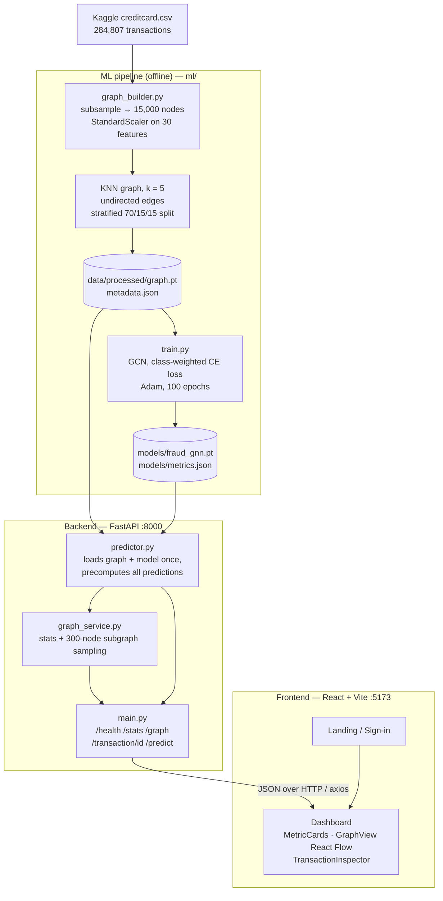

# Credit Card Fraud Detection using Graph Neural Networks

**FraudGraph** is a full-stack demo that detects credit-card fraud with a
**Graph Convolutional Network (GCN)**. Instead of scoring each transaction
on its own, it turns transactions into a graph and links each one to
similar transactions. The GNN then classifies every node using its own
features plus those of its neighbors. A FastAPI backend serves the trained
model, and a React dashboard shows the graph and the predictions.

The full design spec is in [`architecture-2.md`](architecture-2.md), and the
visual design is in [`design-3.md`](design-3.md).

---

## Table of contents

1. [Architecture](#architecture)
2. [Tech stack](#tech-stack)
3. [Dataset](#dataset)
4. [How it works](#how-it-works)
5. [Results](#results)
6. [Project structure](#project-structure)
7. [Download and setup](#download-and-setup)
8. [Running the app](#running-the-app)
9. [API reference](#api-reference)
10. [Demo walkthrough](#demo-walkthrough)
11. [Limitations and future work](#limitations-and-future-work)

---

## Architecture



The GCN model:

```text
x ∈ ℝ^(N×30) ──► GCNLayer(30→32) ──► ReLU ──► GCNLayer(32→16) ──► ReLU ──► Linear(16→2) ──► softmax
                        ▲                            ▲
                        └──── Â = D^-½ (A + I) D^-½ ─┘   (sparse normalized adjacency)
```

Each GCN layer computes `H' = Â · (H W + b)`. Two layers mean every
prediction draws on information from a node's **2-hop neighborhood**.

---

## Tech stack

| Layer | Technology |
| --- | --- |
| ML / graph | Python 3.10+, **PyTorch** (GCN written with `torch.sparse` ops, no `torch_geometric`), scikit-learn (StandardScaler, NearestNeighbors, metrics, splits), pandas, NumPy |
| Backend | **FastAPI**, Uvicorn, Pydantic |
| Frontend | **React 19**, TypeScript 6, **Vite 8**, Tailwind CSS 4, React Flow 11 (graph rendering), React Router 7, Axios |
| Tooling | oxlint (frontend lint) |

---

## Dataset

This project uses the [**Kaggle Credit Card Fraud Detection** dataset](https://www.kaggle.com/datasets/mlg-ulb/creditcardfraud) from the ULB Machine Learning Group.

| Property | Value |
| --- | --- |
| Transactions | 284,807 (two days of European cardholder transactions, Sept 2013) |
| Fraud cases | 492 (**0.172%**, so the classes are highly imbalanced) |
| Features | `Time`, `V1`–`V28` (PCA-anonymized), `Amount`, 30 in total |
| Label | `Class` (1 = fraud, 0 = normal) |
| File | `creditcard.csv`, about 144 MB (gitignored, not included in this repo) |

**Subsampling:** the full dataset is too large for the local-laptop graph
budget, so `ml/graph_builder.py` keeps **all 492 fraud transactions** and
adds a random sample of 14,508 normal ones (seed 42). The result is 15,000
nodes with about 3.3% fraud.

| Built graph | Value |
| --- | --- |
| Nodes | 15,000 |
| Edges (directed, deduplicated) | 111,581 |
| Fraud nodes | 492 |
| Split (stratified) | 70% train / 15% val / 15% test (2,250 test nodes, 74 fraud) |

---

## How it works

1. **Preprocessing.** Load the CSV, subsample it, and standardize all 30
   features with `StandardScaler`.
2. **Graph construction.** Every transaction becomes a node. Each node is
   connected to its **5 nearest neighbors** in scaled feature space
   (Euclidean KNN). Edges are added in both directions and deduplicated.
3. **Model.** A 2-layer GCN with symmetric-normalized adjacency and self
   loops, followed by a linear classifier (see the diagram above).
4. **Training.** Full-batch training for 100 epochs with Adam
   (lr = 0.01, weight decay = 5e-4). Cross-entropy loss is **weighted by
   inverse class frequency** to handle the imbalance. Only train-mask nodes
   count toward the loss.
5. **Evaluation.** Accuracy, precision, recall, F1 and ROC-AUC on the
   held-out test mask. The results are written to `models/metrics.json`.
6. **Serving.** At startup the backend loads the graph and model, runs one
   forward pass over all nodes, and caches every prediction and confidence.
   API calls are then just lookups. `/graph` returns a 300-node subgraph
   built by breadth-first search outward from fraud "seed" nodes along real
   edges, with fraud capped at half the view, so the dashboard shows
   connected neighborhoods instead of isolated dots.

---

## Results

Test-set metrics (2,250 held-out nodes, 74 of them fraud), from
[`models/metrics.json`](models/metrics.json):

| Metric | Score |
| --- | --- |
| Accuracy | **0.976** |
| Precision (fraud) | **0.600** |
| Recall (fraud) | **0.851** |
| F1 (fraud) | **0.704** |
| ROC-AUC | **0.975** |

Approximate confusion matrix, derived from the metrics above:

|  | Predicted normal | Predicted fraud |
| --- | --- | --- |
| **Actual normal** | ~2,134 | ~42 |
| **Actual fraud** | ~11 | ~63 |

**Interpretation.** The class-weighted loss favors **recall**. The model
catches about 85% of fraud but also flags some normal transactions, which
is usually the right trade-off for fraud screening, since a false positive
costs a review while a false negative costs money. Accuracy alone is
misleading on this data, because predicting "normal" for everything
already scores about 97%. ROC-AUC and fraud-class F1 are the metrics that
matter here.

> Results come from a single seeded run on the subsampled graph.
> Re-running `ml.train` may change them slightly.

---

## Project structure

```text
.
├── ml/
│   ├── graph_builder.py     # CSV → subsample → scale → KNN graph → graph.pt
│   ├── model.py             # GCNLayer, FraudGNN, normalized adjacency
│   └── train.py             # training loop, evaluation, saves model + metrics
├── backend/
│   ├── main.py              # FastAPI app + routes + CORS
│   ├── schemas.py           # Pydantic response/request models
│   └── services/
│       ├── predictor.py     # loads model/graph, caches predictions, neighbor index
│       └── graph_service.py # stats + dashboard subgraph sampling
├── frontend/
│   └── src/
│       ├── pages/           # Landing, SignIn, Dashboard
│       ├── components/      # GraphView, TransactionInspector, MetricCard, ArchitectureDiagram, ...
│       ├── lib/             # auth context (demo, localStorage), force layout
│       └── api.ts           # axios client for the backend
├── models/
│   ├── fraud_gnn.pt         # trained weights (committed)
│   └── metrics.json         # test metrics (committed)
├── data/
│   ├── raw/creditcard.csv   # ← you download this (gitignored)
│   └── processed/           # generated graph.pt + metadata.json (gitignored)
├── architecture-2.md        # full system design doc
├── design-3.md              # UI design spec
└── requirements.txt
```

---

## Download and setup

### Prerequisites

- Python **3.10+**
- Node.js **20+** and npm
- A Kaggle account (to download the dataset)

### 1. Clone the repository

```bash
git clone https://github.com/JohnJomi/Credit-Card-Fraud-Detection-using-Graph-Neural-Networks.git
cd Credit-Card-Fraud-Detection-using-Graph-Neural-Networks
```

### 2. Get the dataset

Download `creditcard.csv` from
[Kaggle](https://www.kaggle.com/datasets/mlg-ulb/creditcardfraud), either
in the browser or with the Kaggle CLI:

```bash
kaggle datasets download -d mlg-ulb/creditcardfraud
unzip creditcardfraud.zip -d data/raw/
```

Make sure the file ends up at `data/raw/creditcard.csv`.

### 3. Python environment

```bash
python -m venv .venv
source .venv/bin/activate        # Windows: .venv\Scripts\activate
pip install -r requirements.txt
```

### 4. Frontend dependencies

```bash
cd frontend
npm install
cd ..
```

---

## Running the app

### Step 1: Build the graph and train the model

Run from the repo root:

```bash
python -m ml.graph_builder   # writes data/processed/graph.pt + metadata.json
python -m ml.train           # writes models/fraud_gnn.pt + models/metrics.json
```

The backend always needs `data/processed/graph.pt`, so you must run
`graph_builder` at least once. A trained `models/fraud_gnn.pt` is already
committed, so you can skip `ml.train` if you only want to run the app.

### Step 2: Start the backend

```bash
python -m uvicorn backend.main:app --reload --port 8000
```

- API: http://localhost:8000
- Interactive docs (Swagger): http://localhost:8000/docs

### Step 3: Start the frontend

In a second terminal:

```bash
cd frontend
npm run dev
```

Open **http://localhost:5173**. Sign in with any email or use the demo
login, then go to the dashboard. Sign-in is a client-side demo gate stored
in `localStorage`, not real authentication.

Other frontend scripts: `npm run build` builds for production, `npm run
preview` serves that build, and `npm run lint` runs oxlint.

---

## API reference

| Method | Endpoint | Description |
| --- | --- | --- |
| GET | `/health` | Liveness check → `{"status": "ok"}` |
| GET | `/stats` | Node/edge/fraud counts plus model metrics |
| GET | `/graph` | Sampled 300-node subgraph (nodes with predictions, edges) for visualization |
| GET | `/transaction/{id}` | Amount, time, features, prediction, confidence and neighbor IDs for one node |
| POST | `/predict` | Body `{"transaction_id": int}` → `{"prediction", "confidence"}` |

Example:

```bash
curl http://localhost:8000/transaction/42
curl -X POST http://localhost:8000/predict \
     -H "Content-Type: application/json" -d '{"transaction_id": 42}'
```

CORS allows only `http://localhost:5173`.

---

## Demo walkthrough

1. Open the dashboard and review the live model metrics (precision,
   recall, F1, ROC-AUC).
2. The graph view shows a sample of the transaction graph, with normal and
   fraud nodes colored differently.
3. Click any node to open the **Transaction Inspector**. It shows the
   amount, time, prediction, confidence and features.
4. The node's graph neighbors are highlighted. This shows that the GNN's
   decision depends on connected, similar transactions and not only on the
   transaction by itself.

---

## Limitations and future work

- **Transductive setup.** The model classifies nodes that already exist in
  the graph. A brand-new transaction would first need to be inserted with
  KNN edges, which `/predict` does not support yet.
- **Subsampling** changes the fraud rate from 0.17% to about 3.3%, so the
  reported precision is optimistic compared to the real class balance.
- **No temporal or entity edges.** The anonymized dataset has no card,
  merchant or device IDs, so edges come from feature similarity only.
- Possible next steps: GraphSAGE or GAT layers, early stopping on the
  validation mask, decision-threshold tuning, and inductive inference for
  new transactions.

---

## Acknowledgements

Dataset: Andrea Dal Pozzolo, Olivier Caelen, Reid A. Johnson and Gianluca
Bontempi. *Calibrating Probability with Undersampling for Unbalanced
Classification.* IEEE SSCI, 2015. Distributed under the ODbL license
through Kaggle / ULB Machine Learning Group.
